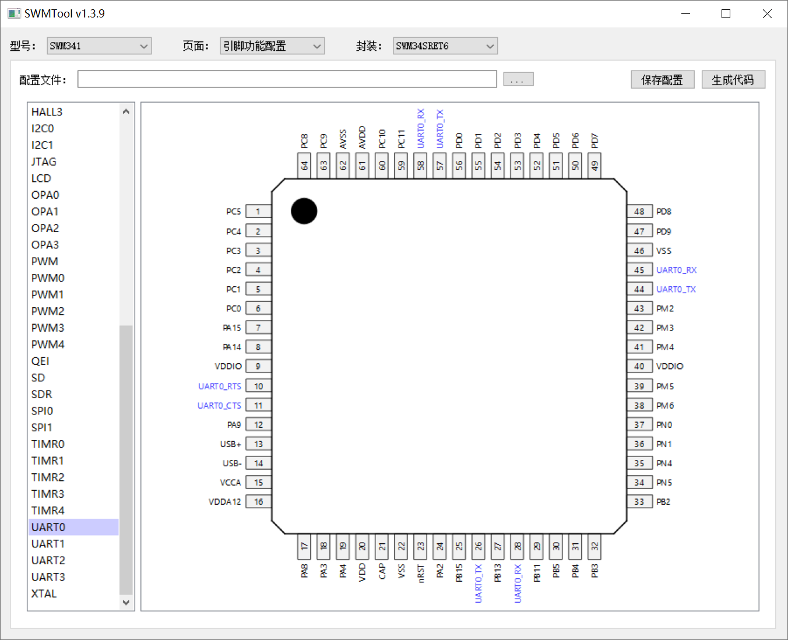
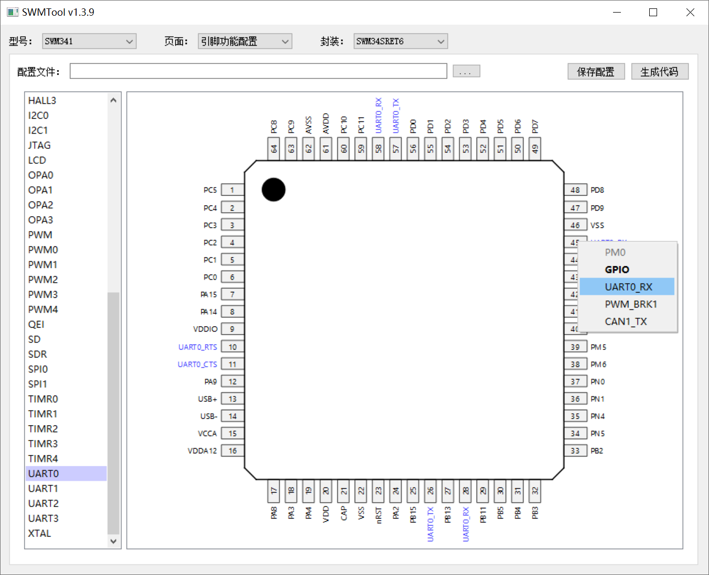
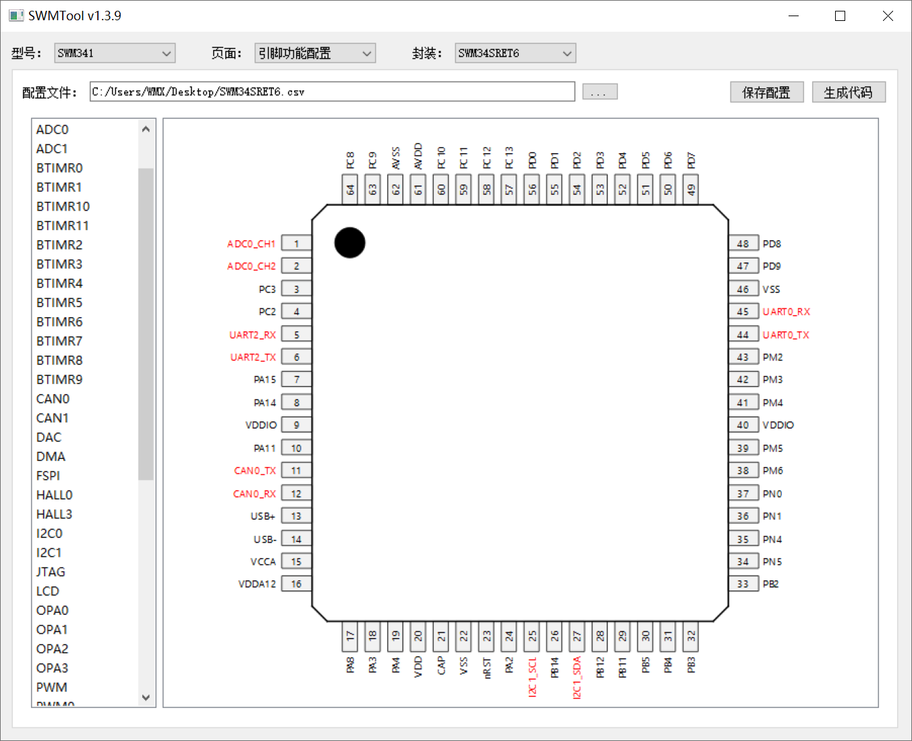

# SWMTool

Synwit MCU 配置工具：图形化引脚功能配置、CAN 波特率参数计算、SDRAM 时序参数计算。

## 引脚功能配置

这个页面分三部分：左侧是该型号所有外设的列表，中间是所选封装的引脚图，顶部一行是配置文件的路径、**保存配置** 和 **生成代码** 按钮。

引脚图上每个引脚都标着它当前的功能名：

- **黑色** —— 默认的 GPIO（未做任何配置时显示引脚名，如 `PM0`）；
- **蓝色** —— 预览：左边列表中被点中的外设能复用到这个引脚，只是提示，还没有写进配置；
- **红色** —— 已经选定并记录下来的复用功能，会被保存和生成代码。

### 1. 查看某个外设能用哪些引脚（预览）

单击左侧列表中的外设名即可预览，例如点 `UART0`，封装图上所有可以复用成 UART0 信号的引脚都会变成蓝色，一眼就能看出这个外设能往哪儿接。再次单击同一项即取消预览。

下图以 SWM34SRET6 为例，选中左侧的 `UART0` 后，8 个可复用为 UART0 的引脚显示为蓝色预览：



预览只是提示，不会修改任何配置，也不影响保存和生成的代码。

### 2. 给指定引脚选择功能

点击引脚本体、引脚编号或引脚名，都会弹出该引脚的功能列表。列表第一行是引脚名（灰显，仅作标题），下面每一行是这个引脚可复用的一个功能；当前生效的功能会加粗显示。单击其中一项即完成选择：



上图点的是 `PM0`，它的可选功能是 `GPIO` / `UART0_RX` / `PWM_BRK1` / `CAN1_TX`，光标指向 `UART0_RX`，单击后 `PM0` 就变成 UART0 的接收脚，引脚名以红色显示。若想把引脚改回普通 IO，在列表里选 `GPIO` 即可（`GPIO` 是默认功能，不会被记入配置文件）。

引脚文字变长、超出窗口时，图形会自动整体缩小，让文字完整显示；按住 `Ctrl` 滚动滚轮可以手动缩放，放大后用滚动条查看顶部 / 底部的引脚。

### 3. 保存、加载和修改配置



配置好引脚功能后，点击 **保存配置** 按钮，指定配置文件保存位置，将修改了功能的引脚记录在 `.csv` 文件中，方便后续加载、查看和修改。文件格式如下：第一行记录完整型号名，之后每行一个引脚，格式为 `引脚序号, 引脚名, 功能名`。

```csv
SWM34SRET6

1, PC5, ADC0_CH1
2, PC4, ADC0_CH2
5, PC1, UART2_RX
6, PC0, UART2_TX
11, PA10, CAN0_TX
12, PA9, CAN0_RX
25, PB15, I2C1_SCL
27, PB13, I2C1_SDA
44, PM1, UART0_TX
45, PM0, UART0_RX
```

点击 **`...`** 按钮，可加载前面保存的 `.csv` 文件，方便查看和修改引脚功能配置。

### 4. 生成初始化代码

点击 **生成代码** 按钮，指定 `.h` 文件的保存位置，程序会为所有选定新功能的引脚生成 `PORT_Init()` 调用，在引脚初始化函数中添加 `#include "SWM34SRET6.h"` 即可在工程中执行这些引脚配置：

```c
PORT_Init(PORTA, PIN9, PORTA_PIN9_CAN0_RX, 1);
PORT_Init(PORTA, PIN10, PORTA_PIN10_CAN0_TX, 1);
PORT_Init(PORTB, PIN13, PORTB_PIN13_I2C1_SDA, 1);
PORT_Init(PORTB, PIN15, PORTB_PIN15_I2C1_SCL, 1);
PORT_Init(PORTC, PIN0, PORTC_PIN0_UART2_TX, 1);
PORT_Init(PORTC, PIN1, PORTC_PIN1_UART2_RX, 1);
PORT_Init(PORTC, PIN4, PORTC_PIN4_ADC0_CH2, 0);
PORT_Init(PORTC, PIN5, PORTC_PIN5_ADC0_CH1, 0);
PORT_Init(PORTM, PIN0, PORTM_PIN0_UART0_RX, 1);
PORT_Init(PORTM, PIN1, PORTM_PIN1_UART0_TX, 1);
```

几点说明：

- 代码只覆盖**选定过新功能**的引脚，其余引脚保持复位后的默认状态，不用在代码里重复配置。
- `PORT_Init()` 的最后一个参数是数字输入使能，程序会按功能自动判断：ADC / ACMP / OPA / DAC 等模拟功能自动填 `0`，数字功能填 `1`。
- 点击生成代码前如果还没保存过配置（路径框里不是 `.csv`），会先提示保存，因为代码与配置文件的对应关系靠它记录。

## CAN 波特率配置

输入主频（MHz）、期望波特率（Kbps）和期望采样点（%），点 **生成配置** 得到若干组可行的 `CAN_bs1 / CAN_bs2 / CAN_sjw / Baudrate` 参数，按与期望采样点的接近程度排序，取前三组。程序只给出能整除、且寄存器放得下的组合，凑不出会明确提示。

## SDRAM 时序配置

选择 SDRAM 器件型号，点 **生成配置**，按主频算出满足器件时序的 `SDRAM_InitStruct` 参数，并按不同的 CAS Latency（SWM341 还会按时钟分频）分别列出可选配置。
